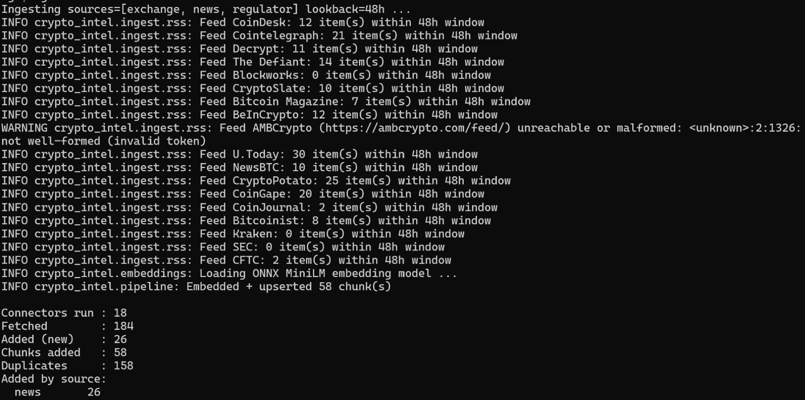
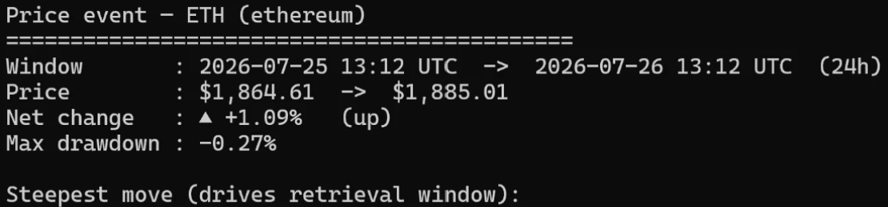
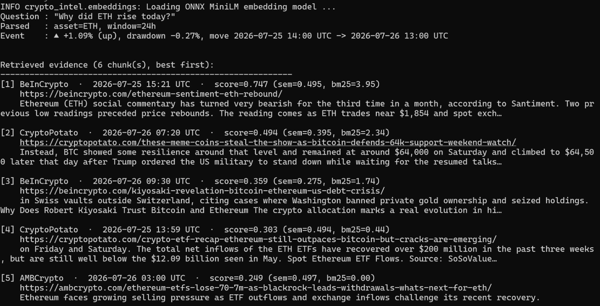
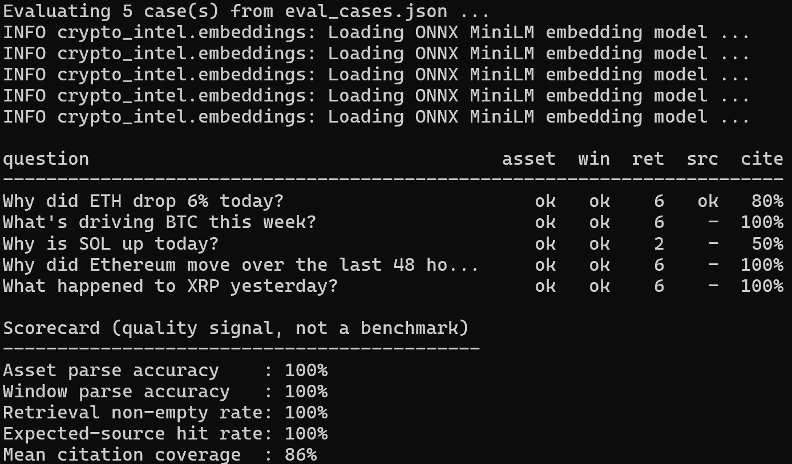
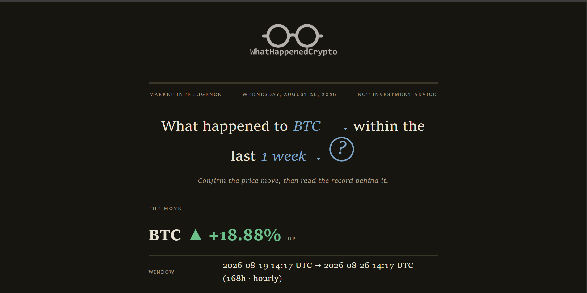
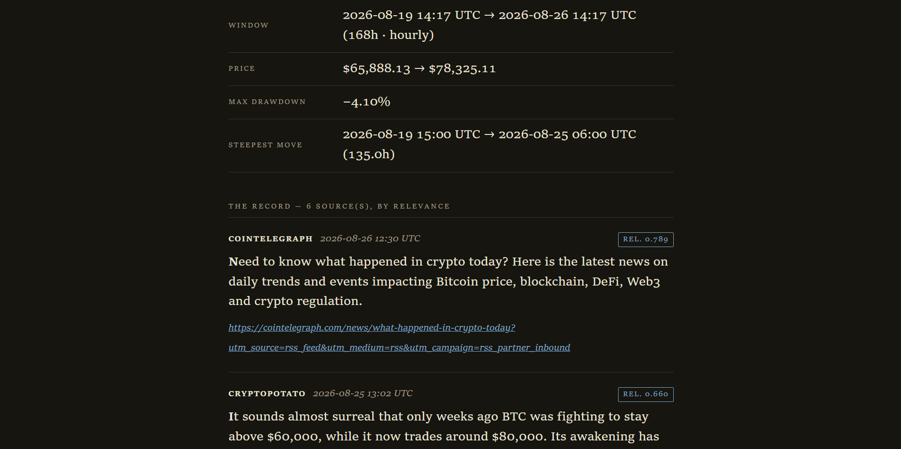

# Crypto Market Intelligence Assistant

A retrieval-augmented CLI that explains crypto price moves ("Why did ETH drop 6%
today?") by **confirming the move against real price data**, then grounding an
answer in **time-windowed evidence** from crypto news, exchange notices, and US
regulator filings — with **inline citations** back to the source URL + timestamp.

> Decision-support tool, **not** investment advice. It never emits buy/sell/hold
> calls or price targets; every `ask` answer ends with a "Not investment advice" line.

What makes it more than "chat over documents":

1. **Grounds the question in a real event.** It pulls actual CoinGecko price data,
   confirms the magnitude and *when* the move happened, and uses that time window
   to drive retrieval — so it reads the news published *around the move*, not just
   anything topically similar.
2. **Answers with citations.** Every claim maps to a specific ingested document
   (source, URL, timestamp), so the answer is auditable rather than a vibe.

---

## Status: complete (S1–S12)

The RAG pipeline runs end-to-end (`ingest → stats → price-event → ask`); S9 adds a
volatility-forecasting subsystem (`train → predict`), S10 a warehouse-backed SQL
feature pipeline (`warehouse build → train --source warehouse`), S11 a full MLOps
loop (MLflow tracking/registry, serving, CI, drift monitoring), and S12 stitches the
two halves together — `ask` weaves the current volatility regime into its cited
answer.

| Phase | What it delivers | State |
|---|---|---|
| S1 | Scaffold, typed config, pydantic models, `stats` | ✅ |
| S2 | Ingestion + normalization (RSS, Reddit, CoinMarketCap), dedup, JSONL store | ✅ |
| S3 | Chunking, MiniLM embeddings, persistent Chroma | ✅ |
| S4 | CoinGecko client + `detect_event` (window %, drawdown, steepest-move window) | ✅ |
| S5 | Question parsing, asset+time-filtered retrieval, BM25 rerank, `ask --no-synth` | ✅ |
| S6 | Grounded synthesis with inline `[n]` citations, full `ask` | ✅ |
| S7 | CMC connector, rounded-out test suite, `--all` runs every connector, clean-clone docs | ✅ |
| S8 | `eval` scorecard — retrieval hit-rate + citation coverage over a committed case set | ✅ |
| S9 | **Volatility / risk-regime forecasting** — `train`/`predict`, a baseline · scikit-learn · XGBoost/LightGBM · PyTorch-LSTM model zoo compared by skill-vs-baseline | ✅ |
| S10 | **Warehouse-backed feature pipeline** — `warehouse build`, DuckDB SQL feature engineering (gridding, rolling window functions, news aggregation) + optional BigQuery loader; `train --source warehouse` | ✅ |
| S11 | **MLOps loop** — MLflow tracking + model registry (`train --track`), FastAPI serving (`/api/forecast`, `/monitoring`), GitHub Actions CI + retrain, Evidently drift monitoring (`monitor`) | ✅ |
| S12 | **RAG↔forecast stitch** — `ask` weaves the current volatility regime into its synthesis prompt + a regime banner (`Answer.market_state`), citations and the not-advice guardrail intact | ✅ |

The **ML expansion (S9–S12) is complete** — see [docs/ML_ROADMAP.md](docs/ML_ROADMAP.md)
for the full design spec.

**166 tests** — 165 pass fully offline; 1 skipped (a live-DB test gated on an env var).
See [docs/ARCHITECTURE.md](docs/ARCHITECTURE.md) for the design spec and architecture
diagram, [docs/ML_ROADMAP.md](docs/ML_ROADMAP.md) for the ML expansion (S9–S12), and
the [As-built notes](#as-built-notes) below for intentional deviations.

## Documentation

| Doc | Covers |
|---|---|
| **This README** | Install, quickstart, commands, configuration, evaluation. |
| [docs/ARCHITECTURE.md](docs/ARCHITECTURE.md) | Design spec: scope, tech stack, pipeline diagram, data model, module map, build history. |
| [docs/GUI.md](docs/GUI.md) | The optional FastAPI web GUI: endpoints, frontend, the no-synthesis design. |
| [docs/DEPLOYMENT.md](docs/DEPLOYMENT.md) | Hosted stack: Netlify frontend + Railway API + Supabase pgvector, Docker, retention. |
| [docs/ML_ROADMAP.md](docs/ML_ROADMAP.md) | The ML expansion (S9–S12): forecasting, warehouse, MLOps loop, the GenAI stitch. |

## Tech stack at a glance

One system spanning retrieval-augmented generation and an end-to-end ML/MLOps loop.

| Layer | Tools |
|---|---|
| **GenAI / RAG** | Anthropic Claude API (grounded, cited synthesis) · MiniLM embeddings (ONNX / sentence-transformers) · **Chroma** + **Postgres/pgvector** vector stores · BM25 rerank · a retrieval + citation-coverage `eval` scorecard |
| **Modelling (S9)** | **scikit-learn** · **XGBoost / LightGBM** · **PyTorch** (LSTM) · a persistence baseline, compared on a temporal split by skill-vs-baseline |
| **Data / scale (S10)** | **DuckDB** SQL feature engineering (window functions, time-bucketing, aggregation) · optional **BigQuery** free-tier loader |
| **MLOps (S11)** | **MLflow** experiment tracking + model registry · **FastAPI** model serving · **GitHub Actions** CI + scheduled retraining · **Evidently** drift monitoring · Docker |
| **Stitch (S12)** | the volatility **regime** conditions the cited `ask` answer — the RAG and ML halves as one product |
| **Engineering** | Python 3.11–3.14 · `typer` CLI · `pydantic` / `pydantic-settings` · **166 tests** (pytest, offline) · deployed (Netlify → Railway → Supabase) |

> **Guardrail throughout.** Decision-support, **not** investment advice: the models
> forecast volatility / risk regime, never price direction; every answer keeps a
> "not investment advice" line.

---

## Requirements

- **Python 3.11+** (developed and tested on 3.14).
- **pip + venv** (or `uv`). A standard `pip install -e .` is torch-free — see
  [Embedding backend](#embedding-backend).
- **Network** for `ingest` (RSS/CoinMarketCap), `price-event`/`ask` (CoinGecko),
  and `ask` synthesis (Claude API). All offline logic is covered by the tests.

## Install

```bash
python -m venv .venv
# Windows: .venv\Scripts\Activate.ps1   |   Unix: source .venv/bin/activate

pip install -e .            # core install (no torch); add [dev] for pytest, [st] for sentence-transformers
cp .env.example .env        # fill in keys as needed (see Configuration)
```

## Quickstart

```bash
# 1) Ingest recent public content into the local store (RSS needs no keys)
crypto-intel ingest --sources news,exchange,regulator --lookback-hours 48

# 2) Inspect the store
crypto-intel stats

# 3) Confirm a price move directly (CoinGecko, no key)
crypto-intel price-event --asset ETH --hours 24

# 4) Ask — retrieval only, no LLM, no key
crypto-intel ask "Why did ETH drop today?" --no-synth

# 5) Ask — full grounded, cited answer (needs ANTHROPIC_API_KEY)
crypto-intel ask "Why did ETH drop 6% today?"

# 6) Eval — a quality-signal scorecard over data/eval_cases.json (no key needed)
crypto-intel eval                 # retrieval metrics only
crypto-intel eval --synth         # adds citation coverage (needs ANTHROPIC_API_KEY)

# 7) Forecast — train + compare volatility models, then predict the next window
#    (needs the forecast extras: pip install -e ".[forecast,gbm,dl]")
crypto-intel train   --asset ETH --models baseline,sklearn,xgboost,lstm
crypto-intel predict --asset ETH  # → next-window realized vol + risk regime

# 8) (Optional) Land data in a DuckDB warehouse and train from SQL-built features
#    (needs the warehouse extra: pip install -e ".[warehouse]")
crypto-intel warehouse build --asset ETH
crypto-intel train --asset ETH --source warehouse

# 9) (Optional) MLOps: track training in MLflow + register, then monitor drift
#    (needs: pip install -e ".[mlops,monitor]")
crypto-intel train   --asset ETH --track      # logs run + registers crypto-intel-vol-ETH
crypto-intel monitor --asset ETH              # Evidently drift report → /monitoring
crypto-intel serve                            # GET /api/forecast?asset=ETH  ·  /monitoring
```

> **Volatility, not price.** `train`/`predict` forecast next-window *realized
> volatility* and a *risk regime* (calm / normal / turbulent) — never price
> direction or a trade call. Every forecast carries a "not investment advice" line.
> See [docs/ML_ROADMAP.md](docs/ML_ROADMAP.md). Use `--offline series.csv` for a
> reproducible, network-free run.

The first `ingest`/`ask` downloads the ~80 MB ONNX embedding model once (cached in
`~/.cache/chroma/`). `crypto-intel --help` lists every command.

---

## Example run

**1. `ingest`** — fetch, normalize, dedup, and embed public content. A dead feed
is skipped with a warning (fail-soft), and already-seen items are deduped.



**2. `price-event --asset ETH --hours 24`** — confirm the move against real
CoinGecko data: window %, max drawdown, and the steepest-move sub-window that
drives retrieval.



**3. `ask "Why did ETH rise today?" --no-synth`** — parse the question, confirm
the event, and return ranked, asset-and-time-filtered evidence with full
provenance (source · timestamp · blended semantic+BM25 score · URL).



**4. `eval`** — a quality-signal scorecard over the committed case set (retrieval
metrics; citation coverage needs a key).


**5. `eval --synth`** — same, plus **mean citation coverage** of the synthesized
answers (fraction of answer sentences carrying a `[n]` marker).



---

## Commands

| Command | Purpose | Key flags |
|---|---|---|
| `ingest` | Fetch → normalize → dedup → embed → persist | `--sources news,exchange,regulator,cmc,reddit`, `--all`, `--lookback-hours N`, `-v` |
| `stats` | Per-source doc/chunk counts + ingest window | — |
| `price-event` | Confirm a move directly (no retrieval) | `--asset ETH`, `--hours N`, `-v` |
| `ask` | Explain a move with cited evidence (+ S12 volatility-regime context) | `--asset`, `--hours`, `--k`, `--sources`, `--no-synth`, `--no-regime`, `--model`, `-v` |
| `eval` | Score retrieval (+ optional citation coverage) over `data/eval_cases.json` | `--cases`, `--synth`, `--k`, `-v` |
| `prune` | Delete stored content older than a rolling retention window | `--keep-days` (default 7), `-v` |
| `ask-db` | Retrieve evidence from the **pgvector DB** (DB-backed `ask --no-synth`) | `--asset`, `--hours`, `--k`, `--sources`, `-v` |
| `train` | Train + compare volatility-forecast models; persist the best | `--asset`, `--models`, `--source coingecko\|warehouse\|offline`, `--offline`, `--news`, `--track`, `-v` |
| `predict` | Forecast next-window realized vol + risk regime | `--asset`, `--model`, `--offline`, `-v` |
| `monitor` | Evidently feature-drift report vs. the training reference | `--asset`, `--model`, `--history-days`, `--offline`, `-v` |
| `warehouse build` | Land prices + doc metadata in DuckDB; engineer features in SQL | `--asset`, `--history-days`, `--offline`, `--dest duckdb\|bigquery`, `--rolling-hours`, `-v` |
| `warehouse stats` | Warehouse row counts + coverage window | `--asset` |

Notes:
- `--sources` accepts a comma-separated subset; `--all` runs every configured
  connector. With neither, `ingest` runs the **default set** (news + exchange +
  regulator + CMC), which excludes Reddit.
- `ask` parses the asset and time window from the question ("today" → 24h,
  "this week" → 168h, "last 12 hours" → 12h, plus a claimed "6%"). Override with
  `--asset` / `--hours`.
- `--model` overrides the synthesis model, e.g.
  `--model claude-haiku-4-5-20251001` for cheaper runs.

---

## Content sources

The default content feed is **RSS** — 15 crypto-news sites (CoinDesk,
Cointelegraph, Decrypt, The Defiant, Blockworks, CryptoSlate, Bitcoin Magazine,
BeInCrypto, AMBCrypto, U.Today, NewsBTC, CryptoPotato, CoinGape, CoinJournal,
Bitcoinist), one exchange blog (Kraken), and two regulators (SEC, CFTC). **No keys
needed.** Feeds are configured in [`crypto_intel/data/feeds.yaml`](crypto_intel/data/feeds.yaml);
a dead or malformed feed logs a warning and is skipped — it never crashes the run.

Two extra connectors:

- **CoinMarketCap** (`--sources cmc`, part of the default set) — pulls the
  `/v1/content/latest` news/headlines feed. Needs `CMC_API_KEY`. ⚠️ That endpoint
  is a **paid-plan** CMC feature; with a free "Basic" key (or no key) it fails soft
  with a logged notice, and the run continues on RSS.
- **Reddit** (`--sources reddit`, opt-in) — needs "script" OAuth credentials.
  Not in the default set.

## Web GUI (optional)

A small **FastAPI + uvicorn** GUI is available behind the `web` extra. The page
is one sentence — *"What happened to `[asset]` within the last `[window]` ?"* —
and the animated **`?`** button fires both `price-event` (the move) and
`ask --no-synth` (the ranked evidence, with relevance scores):

```bash
pip install -e .[web]
crypto-intel serve            # http://127.0.0.1:8000
```

It shows **retrieved evidence, not a written summary** — there is **no LLM
synthesis** in the GUI, so it needs no Anthropic key. The full cited `ask` answer
stays in the CLI. The hosted version runs the frontend on **Netlify** (which proxies
`/api/*` to the Railway API). See [docs/GUI.md](docs/GUI.md) for endpoints and
details, and [docs/DEPLOYMENT.md](docs/DEPLOYMENT.md) for the hosted stack.

## Deployment (optional)

**Web GUI deployed at [whathappenedcrypto](https://whathappenedcrypto.netlify.app/)**.

The CLI runs entirely locally on embedded Chroma — no deployment needed. A hosted
**web** deployment is also supported, split across three services:

- **Netlify** — the static frontend. **Retrieval only, no LLM synthesis** (needs no
  Anthropic key); it proxies `/api/*` to the API.
- **Railway** — the FastAPI API (`price-event` + evidence retrieval) plus a
  3-hourly ingest cron.
- **Supabase** — a shared Postgres/**pgvector** store.

The vector store is pluggable via `STORE_BACKEND`: **`chroma`** (default, embedded)
or **`pgvector`** (`pip install -e .[pg]` + `DATABASE_URL`) — same 384-dim MiniLM
embeddings, drop-in behind `get_store()`. Retention is a rolling window via
`crypto-intel prune --keep-days 7` (or `pg_cron`). The [Dockerfile](Dockerfile)
bakes the ONNX model in (no cold-start download, no torch); a single Railway
service can also host both the page and the API if you don't want the Netlify split.

Deployment files: [`netlify.toml`](netlify.toml), [`Procfile`](Procfile),
[`nixpacks.toml`](nixpacks.toml), [`Dockerfile`](Dockerfile), and
[`deploy/`](deploy/) (`schema.sql`, `retention.sql`, `start.sh`).
**Full step-by-step in [docs/DEPLOYMENT.md](docs/DEPLOYMENT.md).**





## Embedding backend

Defaults to **`onnx`**: `all-MiniLM-L6-v2` (384-dim) via chromadb's bundled
onnxruntime — no torch, nothing extra to install, model auto-downloaded on first
use. To use sentence-transformers instead: `pip install -e .[st]` and set
`EMBED_BACKEND=sentence-transformers`. (See [As-built notes](#as-built-notes) for
why onnx is the default.)

---

## Configuration

Copy `.env.example` to `.env`. `stats`, RSS `ingest`, and `price-event` run with
**no keys**.

| Variable | Needed for | Notes |
|---|---|---|
| `ANTHROPIC_API_KEY` | `ask` synthesis | Without it, `ask` still works with `--no-synth`; the full path prints a clear notice. |
| `CMC_API_KEY` | CMC connector | Paid-plan endpoint; fails soft without it. |
| `REDDIT_CLIENT_ID` / `_SECRET` / `_USER_AGENT` | Reddit connector | Opt-in only. |
| `EMBED_BACKEND` | embedding choice | `onnx` (default) or `sentence-transformers`. |
| `SYNTH_MODEL` | synthesis model | Default `claude-sonnet-5`. |
| `DEFAULT_LOOKBACK_HOURS`, `DEFAULT_K`, `CHROMA_PATH`, … | tuning | Sensible defaults; see `.env.example`. |

The store (`data/store/`) and `.env` are git-ignored.

## Testing

```bash
pip install -e .[dev]
pytest
```

All 70 tests run **offline** — connectors, price detection, retrieval, and
synthesis are exercised with fixtures, a synthetic price series, and injected
fake clients (no network, no API key, no model download).

---

## Evaluation

`crypto-intel eval` runs a small committed case set
([`data/eval_cases.json`](data/eval_cases.json)) and prints a scorecard:

- **Asset / window parse accuracy** — did question parsing recover the expected
  ticker and time window?
- **Retrieval non-empty rate** — did the asset+time filter return anything?
- **Expected-source hit rate** — for cases naming a source, did it appear in the
  retrieved evidence?
- **Mean citation coverage** (`--synth`) — fraction of answer sentences carrying
  a `[n]` marker.

This is a **quality signal, not a benchmark** — scores depend on what's currently
in the store, so run `ingest` first. Edit or extend the cases freely.

## How it works

```
ingest:  connectors → normalize (clean, asset-tag, dedup) → chunk → embed → Chroma + documents.jsonl
ask:     parse question → detect_event (CoinGecko) → time+asset-filtered Chroma query
         → BM25 rerank → dedup by doc → synthesize (Claude, [n] citations) → Answer + Sources
```

Module map: `cli.py` (Typer app) · `config.py` (pydantic-settings) · `models.py`
(pydantic models) · `ingest/` (connectors + registry) · `normalize.py` ·
`chunking.py` · `embeddings.py` · `store.py` (Chroma) · `prices.py` (CoinGecko +
`detect_event`) · `retrieve.py` (parsing + BM25) · `synthesize.py` (Claude +
citations) · `pipeline.py` (`ingest_all`, `retrieve_context`, `ask`). Full
responsibilities and the data model are in [docs/ARCHITECTURE.md](docs/ARCHITECTURE.md).

## seeding the DB from local machine (Windows commands)

```
.\.venv\Scripts\Activate.ps1
$env:STORE_BACKEND = "pgvector"
$env:DATABASE_URL = "postgresql://.../postgres"
crypto-intel ingest --sources news,exchange,regulator --lookback-hours 168
.\.venv\Scripts\crypto-intel.exe stats            #verify
```

## As-built notes

Where the implementation intentionally diverges from the original spec in
[docs/ARCHITECTURE.md](docs/ARCHITECTURE.md):

- **Reddit → CoinMarketCap as the default content connector.** Reddit's OAuth app
  setup proved impractical, so CMC was brought forward (originally S7) and Reddit
  made opt-in. In practice the keyless **RSS feeds carry the news load**, since
  CMC's content endpoint is paid-tier.
- **`onnx` is the default embedding backend, not sentence-transformers.** `torch`
  won't `pip install` under this repo's long Windows path (`WinError 206`), and
  enabling system-wide long paths is out of scope. chromadb's bundled ONNX MiniLM
  is the same model with zero extra dependencies, so `pip install -e .` works
  out-of-the-box; sentence-transformers moved to the optional `[st]` extra.

## Limitations (honest framing)

This is a **demo**, not a production data platform. Coverage is bounded by whatever
was ingested in the recent lookback window; retrieval quality depends on it. No
real-time streaming, no web UI/API, English-only, no historical backfill. It does
not trade, route orders, or give financial advice.
